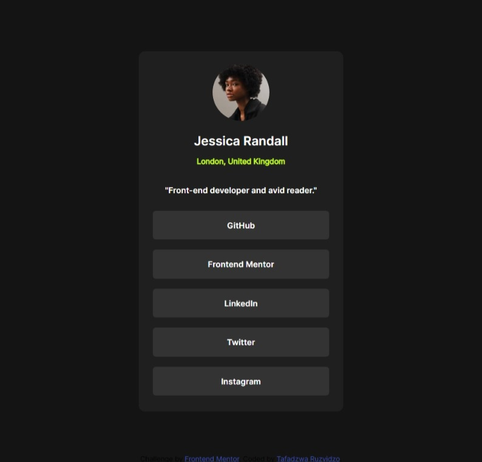

# Frontend Mentor - Social links profile solution

This is a solution to the [Social links profile challenge on Frontend Mentor](https://www.frontendmentor.io/challenges/social-links-profile-UG32l9m6dQ). Frontend Mentor challenges help you improve your coding skills by building realistic projects. 

## Table of contents

- [Overview](#overview)
  - [The challenge](#the-challenge)
  - [Screenshot](#screenshot)
  - [Links](#links)
- [My process](#my-process)
  - [Built with](#built-with)
  - [What I learned](#what-i-learned)
  - [Continued development](#continued-development)
  - [Useful resources](#useful-resources)
- [Author](#author)
- [Acknowledgments](#acknowledgments)

## Overview

### The challenge

Users should be able to:

- See hover and focus states for all interactive elements on the page

### Screenshot




### Links

- Solution URL: [Add solution URL here](https://your-solution-url.com)
- Live Site URL: [Add live site URL here](https://your-live-site-url.com)

## My process

### Built with

- Semantic HTML5 markup
- CSS variables
- Flexbox
- Mobile-first workflow

### What I learned

I learn to use CSS to change the cursor to poitner.
I deepen my understanding of including fonts into css.
I also learn a litle about mobile first workflow.

To see how you can add code snippets, see below:

```html
<body>
  <article>
    <figure>
      
      <figcaption>
        <h1>Jessica Randall</h1>
        <h2>London, United Kingdom</h2>
        <p>"Front-end developer and avid reader."</p>
      </figcaption>
    </figure>
    <section>
      <a href="#">GitHub</a>
      <a href="#">Frontend Mentor</a>
      <a href="#">LinkedIn</a>
      <a href="">Twitter</a>
      <a href="#">Instagram</a>
    </section>
  </article>
    
  <footer class="attribution">
    Challenge by <a href="https://www.frontendmentor.io?ref=challenge" target="_blank">Frontend Mentor</a>. 
    Coded by <a href="#">Tafadzwa Ruzvidzo</a>.
  </footer>
</body>
```
```css
@font-face {
    font-family: "Inter-bold-font";
    src: url(assets/fonts/static/Inter-Bold.ttf);
}
@font-face {
    font-family: "Inter-regular-font";
    src: url(assets/fonts/static/Inter-Regular.ttf);
}
@font-face {
    font-family: "Inter-semibold-font";
    src: url(assets/fonts/static/Inter-SemiBold.ttf);
}
@font-face {
    font-family: "Inter-varible-font";
    src: url(assets/fonts/Inter-VariableFont_slnt\,wght.ttf);
}
:root{
    /* Primary */
    --Green: hsl(75, 94%, 57%);
    --font-family-bold: "Inter-bold-font";
    --font-family-semibold: "Inter-semibold-font";
    --font-family-regular: "Inter-regular-font";
    --font-family-Primary: "Inter-varible-font";
    
    /*Neutral */
    --White: hsl(0, 0%, 100%);
    --Grey: hsl(0, 0%, 20%);
    --Dark-Grey: hsl(0, 0%, 12%);
    --Off-Black: hsl(0, 0%, 8%);
}
```

### Continued development

I would like to have a deep understanding of HTML a CSS. On CSS I would like to learn more about the moblie first workflow and the Grid layout.


### Useful resources

- [freecodecampe](https://www.freecodecampe.com) - This is a usiful site to introduce your self with CSS and HTML.
- [W3schools](https://www.w3schools.com) - It helped to polish some of the concepts that I was not good at.


## Author

- Website - [Add your name here](https://www.your-site.com)
- Frontend Mentor - [@Taffy-R](https://www.frontendmentor.io/profile/@Taffy-R)
- Twitter - [@tafadzwaruzvidz](https://www.twitter.com/@tafadzwaruzvidz)
